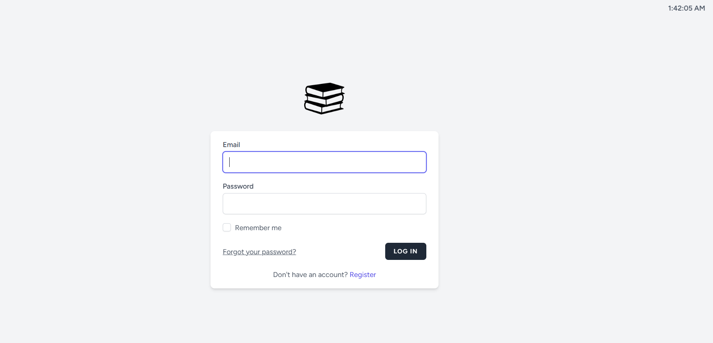
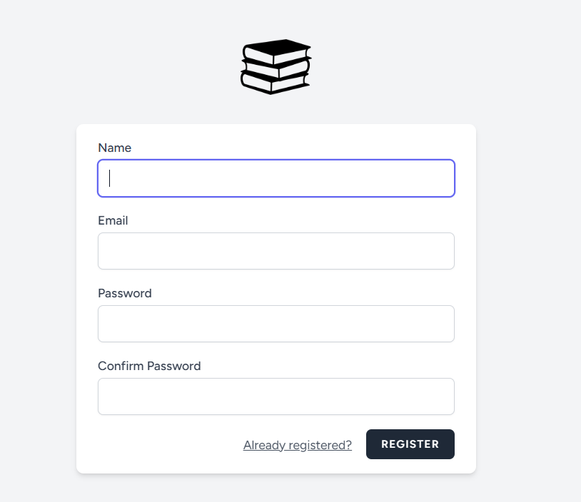

# BukuNest Php + Laravel
 

# **📚 BukuNest**

*Platform laravel modern untuk manajemen perpustakaan online.  
Dirancang agar pengembang dapat dengan mudah membangun aplikasi perpustakaan digital interaktif.*

*Built with the tools and technologies:*

## 🎯 Fitur Unggulan

- 🔐 **Login, Register & Logout** (Auth bawaan Laravel + role admin/user).
- 📚 **CRUD Buku:** Tambah, ubah, hapus, dan tampilkan list buku + upload cover.
- 🏷️ **CRUD Genre:** Tambah, ubah, hapus genre buku.
- 👤 **Profile User:** Update profil dan ganti password.
- 💬 **Fitur Komentar:** Pengguna bisa komentar di detail buku.
- 🛡️ **Middleware Role:** 
  - Public (bisa lihat list & detail buku/genre)
  - Auth User (akses komentar & profil)
  - Admin (akses dashboard & CRUD)
- 🔗 **Relasi Lengkap:** User, Book, Genre, Comment.

---

## 🎬 **Video Presentasi**

👉 Klik gambar di bawah untuk menonton demo lengkap aplikasi BukuNest:

[

---

## 🧭 **Struktur Fitur & Routing Utama**

| Fitur              | Endpoint / Route                          | Proteksi                  |
|-------------------|--------------------------------------------|--------------------------|
| Home              | `/`                                       | Public                   |
| List Buku         | `/books`                                   | Public                   |
| Detail Buku       | `/books/{id}`                              | Public                   |
| List Genre        | `/genres`                                  | Public                   |
| Detail Genre      | `/genres/{id}`                             | Public                   |
| Tambah Komentar   | `/books/{id}/comments`                    | Auth User                |
| Admin Dashboard   | `/admin`                                   | Admin                    |
| CRUD Buku         | `/admin/books`                             | Admin                    |
| CRUD Genre        | `/admin/genres`                            | Admin                    |
| Update Profile    | `/profile`                                 | Auth User                |
| Update Password   | `/profile/password`                        | Auth User                |

---

## 🖼️ **Galeri Tampilan & API**

### 🔐 Auth

**Form Login**

**Form Register**

---

### 📚 Admin Dashboard & Buku

**Dashboard Admin**

**Tambah Buku**

**Edit Buku**

---

### 🏷️ Genre

**List Genre**

**Tambah Genre**

---

### 💬 Komentar & Detail Buku

**Detail Buku + Komentar**

---

### 👤 Profile

**Edit Profil**

---

## ✅ **Kesimpulan (Bahasa sehari-hari)**

> “Ini adalah proyek akhir saya bernama **BukuNest**.  
> Isinya ada fitur CRUD buku & genre, login register, komentar, dan profile user.  
> Ada dashboard admin juga supaya mudah ngatur data.  
> Terima kasih sudah menonton!”

---

@christian J Hutahaean
